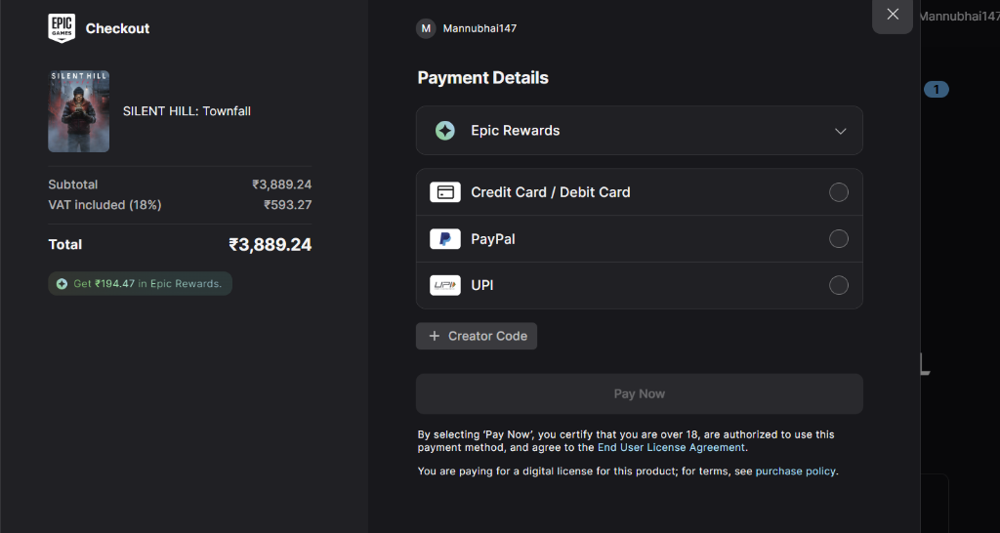
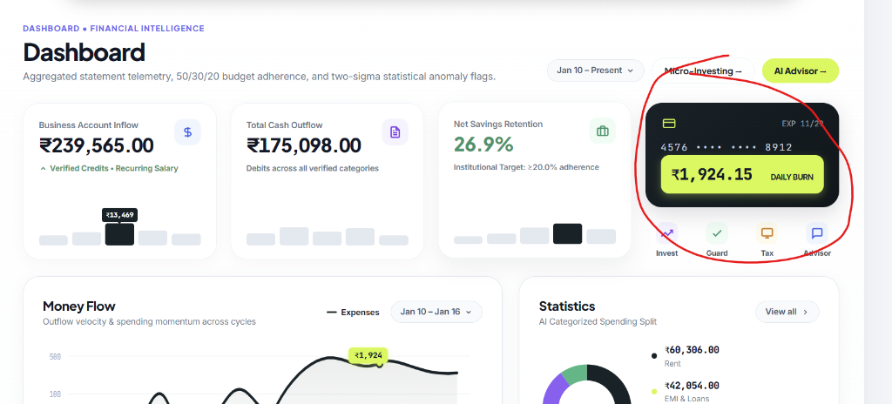
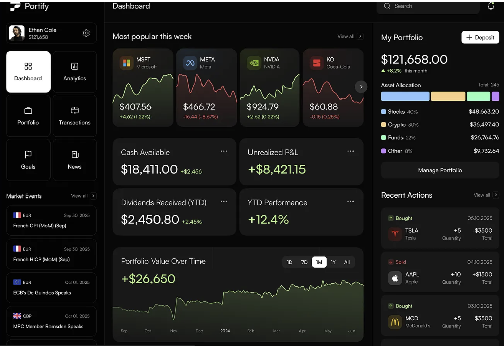
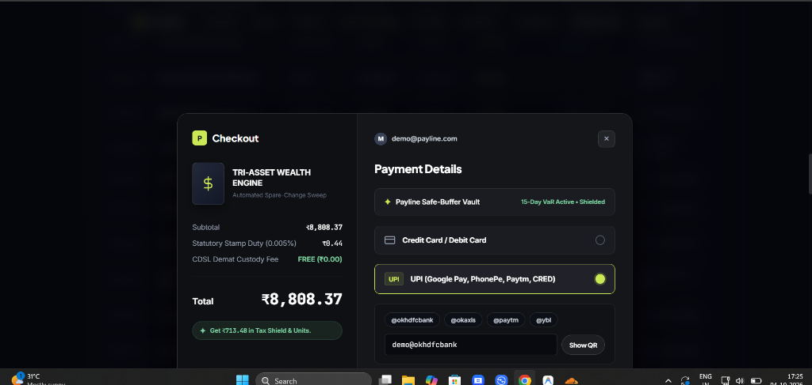
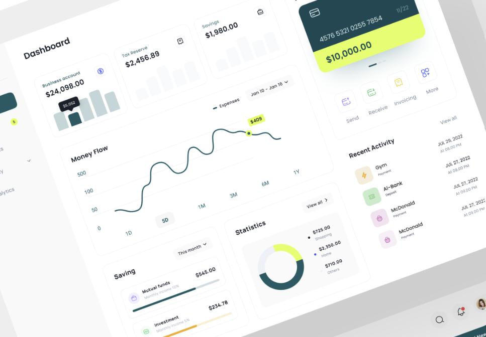
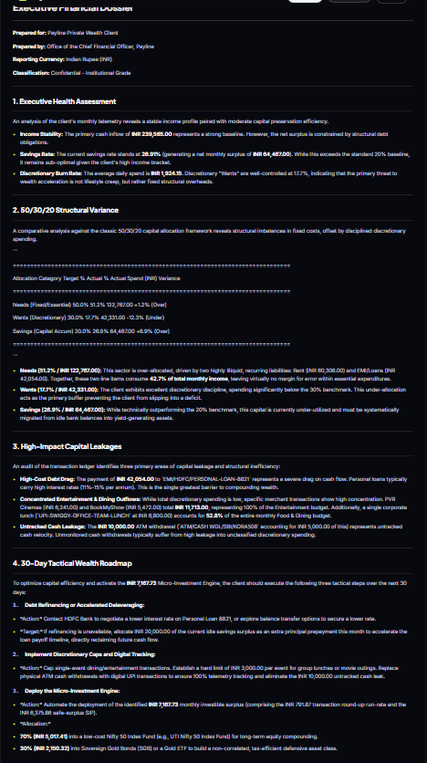
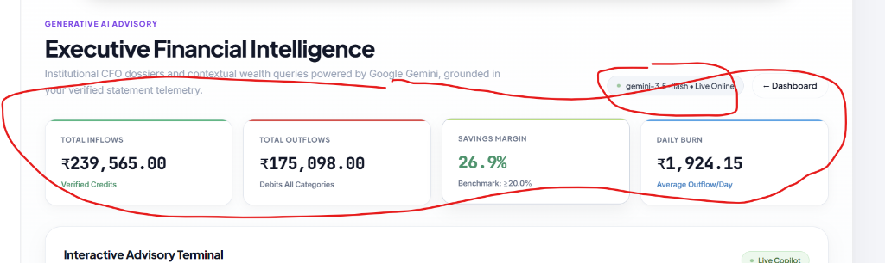
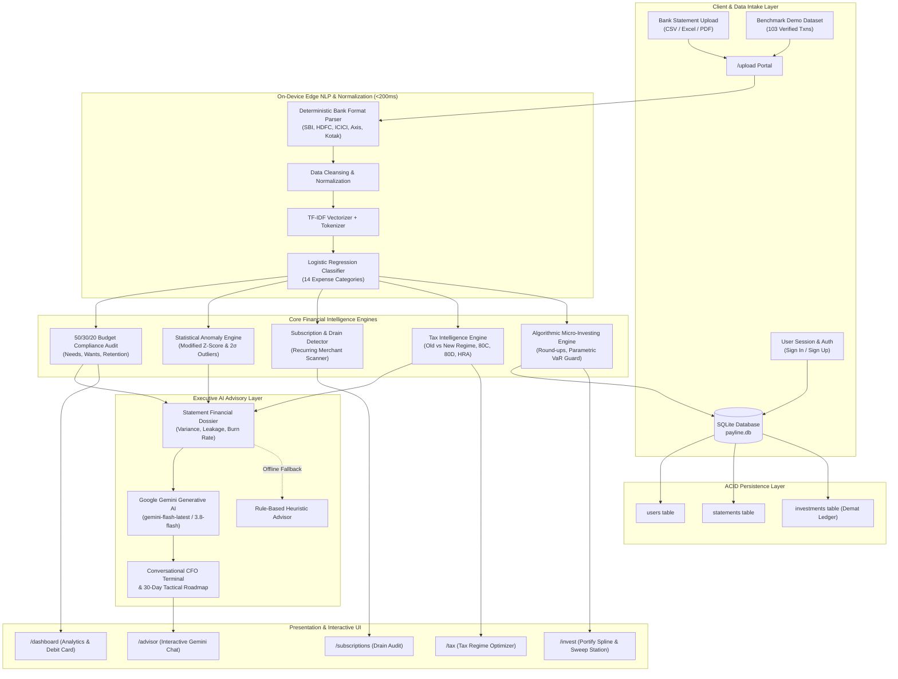

# Payline | Enterprise Financial Intelligence & Algorithmic Wealth Engine

[](https://www.python.org/)
[](https://flask.palletsprojects.com/)
[](https://scikit-learn.org/)
[](https://deepmind.google/technologies/gemini/)
[](https://www.sqlite.org/)
[](LICENSE)

> **Bridge the gap between raw, unstructured banking statements and algorithmic wealth creation.**
> Payline combines sub-200ms on-device machine learning with cloud-resilient Google Gemini reasoning to deliver institutional CFO-grade personal financial telemetry, automated round-up investing, and tax optimization.

---

## Visual Showcase

### 1. Statement Ingestion & Normalization Portal (`/upload`)
Ingests multi-bank statements (HDFC, ICICI, SBI, Axis, Kotak, etc.) with sub-second local NLP normalization.


### 2. Financial Health & Anomaly Analytics (`/dashboard`)
Executive cashflow tracking, 50/30/20 budget adherence audit, two-sigma ($>2\sigma$) anomaly detection, and physical white debit card telemetry.


### 3. Algorithmic Micro-Investing Hub (`/invest`)
Portify-inspired wealth accumulation terminal featuring live NAV tickers, interactive performance spline charts, round-up sweep rules (₹10, ₹50, ₹100), Demat holdings, and Parametric VaR liquidity guards.


### 4. Interactive Sweep Checkout Station
Simulated transaction checkout supporting UPI, Net Banking, and Debit Cards with instant UTR generation, automated unit allotment, and Demat ledger updates.


### 5. Tax Intelligence & Regime Optimizer (`/tax`)
Comparative tax audit evaluating the Old Regime against the New Regime under Indian Income Tax provisions (Section 80C, 80D, HRA deductions).


### 6. Recurring Subscriptions & Capital Drain Detector (`/subscriptions`)
Automated recurring merchant detection auditing fixed monthly commitments and identifying zombie subscriptions.


### 7. Google Gemini Conversational CFO Advisor (`/advisor`)
Context-grounded natural language intelligence analyzing the statement dossier with strategic 30-day tactical roadmaps.


---

## Architectural Diagram



---

## Detailed System Capabilities

### 1. Zero-Leakage On-Device NLP Categorizer
- **Sub-200ms Inference:** Runs locally on CPU without sending raw banking records over the network.
- **Hybrid Machine Learning:** Combines tokenized regular expressions with a scikit-learn TF-IDF Vectorizer and Multinomial Logistic Regression model trained on 130+ Indian merchant strings (UPI VPAs, NEFT/IMPS narratives, Swiggy, Zomato, Amazon, BESCOM, etc.).
- **14 Financial Categories:** Housing, Groceries, Dining, Transportation, Utilities, Healthcare, Entertainment, Shopping, Debt Service, Investments, Transfers, Income, Subscriptions, and Miscellaneous.

### 2. Institutional Financial Health & Anomaly Audit
- **50/30/20 Rule Verification:** Continuously benchmarks essential needs (<=50%), discretionary desires (<=30%), and net wealth retention (>=20%).
- **Statistical Anomaly Detection:** Applies Modified Z-Score with Median Absolute Deviation (MAD) and two-sigma ($>2\sigma$) thresholding to flag suspicious billing spikes and duplicate charges.
- **Velocity Metrics:** Computes daily burn velocity, cash surplus margin, and merchant concentration indices.

### 3. Algorithmic Spare-Change Micro-Investing Station
- **Portify-Inspired Visual Interface:** Live NAV tickers for Indian broad market funds, sovereign gold, and liquid yields, complemented by interactive spline charts with timeframe pills (`1D`, `7D`, `1M`, `1Y`, `All`).
- **Dynamic Sweep Rules:** Simulates round-ups to the nearest ₹10, ₹50, or ₹100.
- **Parametric VaR Liquidity Guard:** Computes a 15-day Value-at-Risk ($95\%$ confidence) liquidity floor from daily spending volatility, ensuring automated sweeps never trigger bank overdrafts.
- **Live Demat Holdings Ledger:** Tracks scheme allotment, accumulated units, weighted average NAV, invested cost, and real-time portfolio market value.
- **Interactive Simulated Checkout:** Full checkout modal with UPI, Net Banking, and Debit Cards, generating unique order IDs (`ORD-PAYLINE-...`), transaction UTR numbers, and receipt summaries.

### 4. Indian Income Tax Intelligence Suite
- **Comparative Tax Engine:** Computes liability under both Old and New Tax Regimes based on FY 2024-25 / 2025-26 tax slabs.
- **Automatic Deduction Harvest:** Audits statement transactions for Section 80C investments (ELSS, PPF, EPF, Life Insurance), Section 80D health insurance premiums, and House Rent Allowance (HRA) exemptions.
- **Regime Recommendation:** Provides clear financial guidance on which regime maximizes net take-home salary.

### 5. Subscription & Drain Detection
- **Recurring Payment Scanner:** Surfaces automated monthly or quarterly standing instructions (Netflix, Spotify, AWS, Gym, broadband).
- **Zombie Subscription Alert:** Flags recurring payments that exhibit negligible utility or rapid price creep.

### 6. Grounded Gemini Conversational CFO
- **Context-Grounded Advisory:** Injects a structured statement telemetry dossier (KPIs, variance flags, burn velocity) into Google Gemini Flash models.
- **CFO-Grade Action Plan:** Delivers prioritized recommendations, savings leak closures, and a 30-day tactical roadmap.
- **High-Availability Fallback:** If internet or Gemini API access is unavailable, falls back automatically to an on-device rule-based heuristic advisor.

---

## Technology Stack

| Layer | Technologies |
| :--- | :--- |
| **Backend & Web Framework** | Python 3.10+, Flask 3.0, Werkzeug, Jinja2 |
| **Data Processing & Analytics** | Pandas, NumPy |
| **Machine Learning & Statistics** | scikit-learn (TF-IDF, Logistic Regression, Modified Z-Score, Parametric VaR) |
| **Generative Artificial Intelligence** | Google Gemini API (`gemini-flash-latest`, `gemini-3.8-flash`) |
| **Database & Persistence** | SQLite 3 (ACID-compliant with WAL mode, parameterized queries) |
| **Frontend & Visualization** | Plus Jakarta Sans, Inter, JetBrains Mono, Pure CSS Glassmorphism, Inline SVG Visualizations |
| **Security & Isolation** | Local `.env` isolation, SHA-256 password hashing, strict `.gitignore` |

---

## Getting Started

### Prerequisites
- Python 3.10 or higher
- Git
- Google Gemini API Key *(Optional: app works 100% offline with local heuristic mode if no API key is provided)*

### 1. Clone the Repository
```bash
git clone https://github.com/your-username/payline.git
cd payline
```

### 2. Set Up Virtual Environment
```bash
# Windows
python -m venv venv
venv\Scripts\activate

# macOS / Linux
python3 -m venv venv
source venv/bin/activate
```

### 3. Install Dependencies
```bash
pip install -r requirements.txt
```

### 4. Configure Environment Variables
Copy the example environment template:
```bash
# Windows (PowerShell)
Copy-Item .env.example .env

# Linux / macOS
cp .env.example .env
```

Edit `.env` with your preferred settings:
```env
# Google Gemini API Key (Get yours at https://aistudio.google.com/app/apikey)
GEMINI_API_KEY=your_gemini_api_key_here

# Flask Session Encryption Secret Key
SECRET_KEY=payline-enterprise-secret-key-2026
```

### 5. Launch the Application
```bash
python app.py
```
Open your browser and navigate to:
```
http://127.0.0.1:5000
```

### 6. Default Demo Credentials
The application automatically seeds a secure demo account for immediate evaluation:
- **Email:** `demo@payline.com`
- **Password:** `password123`
- **Pre-loaded Dataset:** 103 verified Indian banking transactions with comprehensive category breakdown, anomaly flags, and Demat holdings.

---

## Bank Statement Formats Supported

Payline includes normalization adapters for standard Indian bank exports:

| Institution | Supported Columns |
| :--- | :--- |
| **HDFC Bank** | `Date`, `Narration`, `Chq./Ref.No.`, `Value Dt`, `Withdrawal Amt.`, `Deposit Amt.`, `Closing Balance` |
| **ICICI Bank** | `Transaction Date`, `Value Date`, `Description`, `Cheque Number`, `Debit`, `Credit`, `Balance` |
| **State Bank of India (SBI)** | `Txn Date`, `Value Date`, `Description`, `Ref No./Cheque No.`, `Debit`, `Credit`, `Balance` |
| **Axis Bank** | `Tran Date`, `CHQNO`, `PARTICULARS`, `DR`, `CR`, `BAL` |
| **Standard Universal CSV** | `Date`, `Description`, `Amount`, `Type` (Debit/Credit), `Balance` |

---

## Repository Structure

```
payline/
├── docs/
│   └── screenshots/              # UI walkthrough screenshots
├── templates/
│   ├── base.html                 # Master layout & global fintech styling
│   ├── index.html                # Explanatory system overview
│   ├── upload.html               # Statement ingestion portal
│   ├── dashboard.html            # Health analytics, 50/30/20 audit & debit card
│   ├── invest.html               # Micro-investing station & sweep checkout
│   ├── tax.html                  # Old vs New Regime tax suite
│   ├── subscriptions.html        # Recurring payments & zombie drain audit
│   ├── advisor.html              # Gemini conversational AI terminal
│   ├── login.html                # User authentication portal
│   └── signup.html               # Account creation portal
├── static/
│   ├── css/                      # Custom stylesheets
│   └── js/                       # Client-side helpers
├── analyzer.py                   # Core ML categorizer, 50/30/20 & anomaly engine
├── app.py                        # Flask server, route controllers & API endpoints
├── database.py                   # SQLite database models, hashing & Demat persistence
├── gemini_advisor.py             # Google Gemini API integration & dossier engine
├── tax_optimizer.py              # Tax regime comparison & deduction auditor
├── sample_data.py                # Synthetic dataset generation utility
├── sample_statement.csv          # 103-transaction benchmark banking dataset
├── requirements.txt              # Production Python package dependencies
├── .env.example                  # Environment configuration template
├── .gitignore                    # Hardened Git exclusions
└── README.md                     # Project documentation
```

---

## Security & Data Privacy

- **Zero Remote Storage of Financial Data:** Bank statements are processed on-device in volatile application memory.
- **Credential Protection:** Passwords are encrypted using salted PBKDF2:SHA256 hashes.
- **Git Leak Prevention:** `.env`, `.db`, `uploads/`, and sensitive test statement exports are strictly excluded via `.gitignore`.
- **Public Template Isolation:** Only sanitized placeholders in `.env.example` are committed to version control.

---

## License

This project is licensed under the MIT License — see the [LICENSE](LICENSE) file for details.
